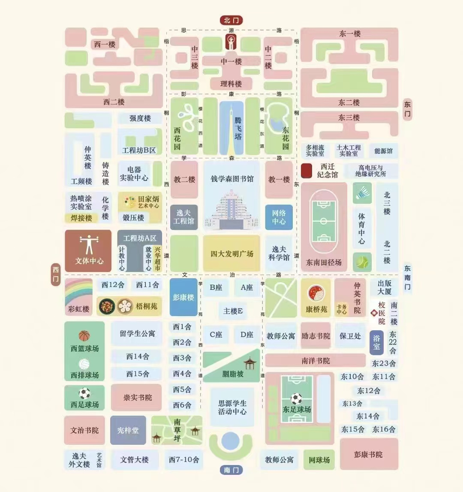

## 报道相关

### 入校

一般来说从初始的进入校门到将行李搬进读者的宿舍，这个过程并不伴随着迷路或者迷茫，大量的志愿者被培训，并用于指引新生，他们会带领你前往寝室，顺带帮你带上你的行李。

### 交大地图

在这里给出西交兴庆校区的地图，对于正在观看本教程且或许正在校园中行走的新生来说，这或许是有帮助的。

西交的校园不算很大，一个月后便可以熟悉<del>（甚至笔者这种路痴也已经不会迷路）</del>，因此无需陷入迷路的恐慌中。更何况初来乍到，即使人生地不熟，在入校的大多数时候，校园里依然流窜着大量老生志愿者，可以咨询问路。

### 配备基础设施

在来到了宿舍之后，一系列的基础设施需要被设置，其中或许包括空调等，尤其在报道时的炎热夏天，对于空调的需求尤为迫切。

读者可能需要做的事情是：

- 办理入学手续以及报道：志愿者会帮助你完成一切事情，前往报道地点并跟随指引即可。忘记或者就是懒得带身份证复印件的可以前往康桥三楼打印店进行复印。
- 开通空调：可以通过看地图或者问路前往开通空调的地方。开通空调需要要缴纳押金，同时其排队人数较多，先下手为强或许是必须的。
- 购买桶装水：和空调在一个地方，可以缴纳押金购买水桶以及水票，购买后将空桶与水票一同放在宿舍门口即可有专人更换。<u>\[1\]</u>
- 搬行李<del>（狠狠压榨志愿者，他们做志愿会获得大量工时，不压榨就亏本了，别心存愧疚）</del>。

<small><u>\[1\]</u>: 不建议买饮水机和水泵，笔者当时领到的有点脏，网购一个电动的水泵是更好的选择，省力且好用，价格也并不昂贵。</small>