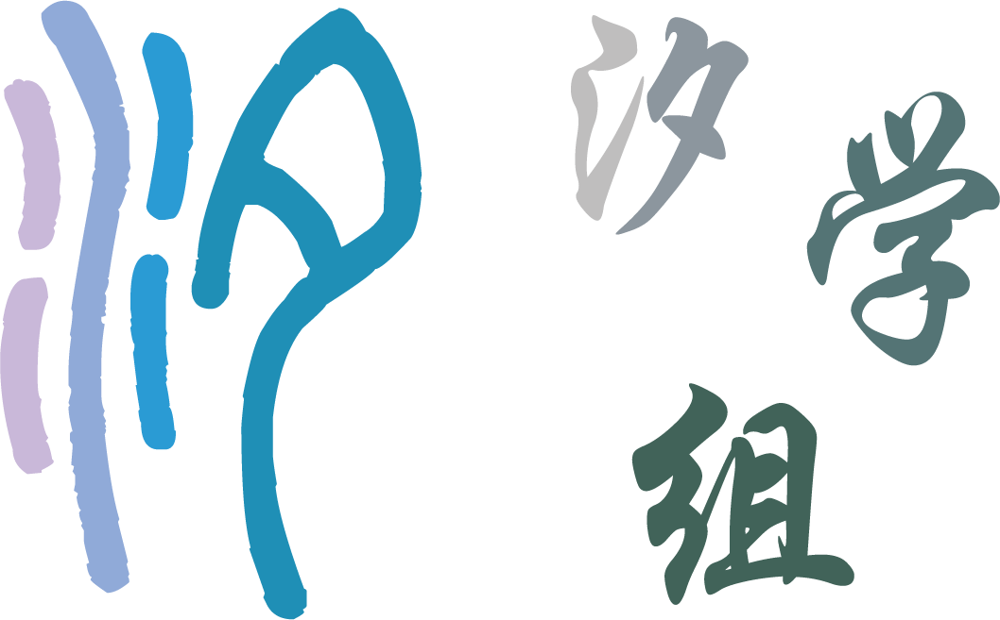

# 关于我们

这里是汐学组 **\[ [主页](https://xistudygroup.github.io/) | [GitHub](https://github.com/XiStudyGroup) \]**，一个致力于知识开源与分享的学生组织，并且正在努力扩大自己的影响力，以帮助到更多的人！

无论是教程/指南/复习资料，我们都有制作，并稳定产出！🎉

大多数内容将从之前的 QQ 群组缓慢迁移至 GitHub，并将 GitHub 作为将来资料的首发平台。

加入我们，学习各种知识，并使用 Markdown & $\LaTeX$ 制作资料，为开源社区贡献自己的力量。❤️

目前本组织的目标主要包括：

- 创作《西安交大生存指南》，旨在帮助西安交大新生与老生。
- 创作学科复习资料。
- 维护《人工智能自学指南》，旨在为人工智能初学者提供快速入门的途径。
- 更新《学点没用的》月刊，旨在为 CS/AI 领域学生/从业者提供可能不属于自己领域的优质教程，用于拓展知识面。

## 关于本书

本书为西安交通大学生存指南，由汐学组进行更新与维护，限于本学组中绝大多数同学来自人工智能专业，因此部分内容可能含有人工智能专业的倾向性，欢迎有识之士进行进一步的拓展。

尽管本书作者的 imbalance 带来了内容的 inductive bias，但众笔者依然希望可以为西安交通大学的新生带来帮助，一方面这些内容可能是务实的，诸如学习的节奏与科研的选择，最终的保研的路线等；一方面本书中保留部分对 <strong>[上海交通大学生存手册](https://survivesjtu.gitbook.io/survivesjtumanual)</strong> 的拙劣模仿，对于身处大学中的心态与处事之道仍尝试给出自己的见解。尽管大多数时候，本书还承担了一些“幼教”性质的指引工作。

最后，欢迎来到西安交通大学。