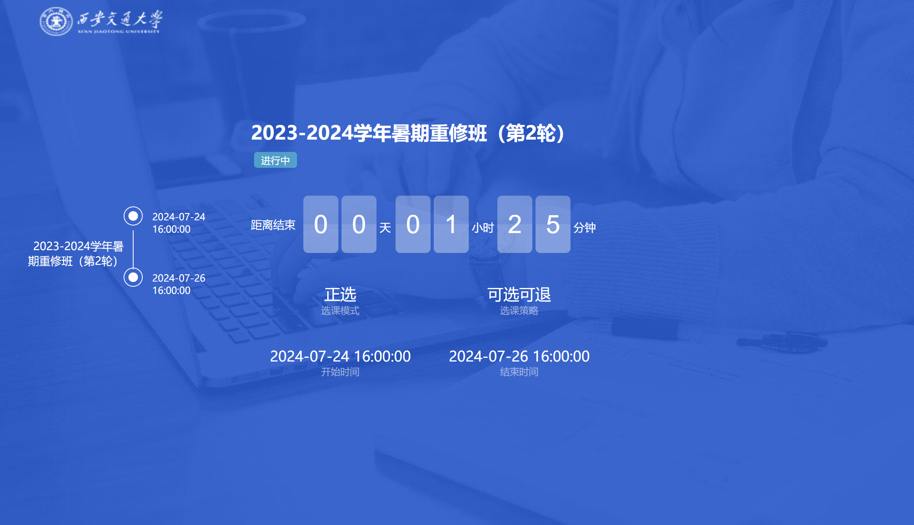

# 选课相关

选课端网址为 [https://xkfw.xjtu.edu.cn/](https://xkfw.xjtu.edu.cn/)，建议在 PC 端登录，该网页的移动端的页面适配可能不太好。当然，移动交通大学中也有选课界面，然而功能更加缺失，没有对于课程的筛选这一功能。

首先在选课的时候需要确认进入的选课轮次，如果你发现你什么也选不了那很有可能是进入了错误的伦茨，PC 端可以在“开始选课”界面的右侧切换轮次。

登录后如果出现如下图没有“开始选课”按钮的情况，此为选课端的经典 BUG，在登录选课端->关闭选课端->再次进入选课端网址之后会稳定触发，一种解决方案是删除浏览器的 cookie，如果你不知道什么是 cookie 那么换个浏览器也是合理的选择。

粗浅的理解来说，假如不删除 cookie，过了一段时间原浏览器就会要求重新登录，便可以按照正常流程选课，无需担心浏览器彻底“废掉”，仅是在短时间内无法用该浏览器进入选课端而已。

## 第一轮预选

第一轮选课是不用抢的，只要在相应的时间段内选择就可以了，但要记得选，否在在第二轮选课中可能竞争比较激烈。

选课顺序一般为主修推荐课程、体育课、重修课程/辅修课程（没有则不选）、基础通识类（核心/选修）课程、其他。

### 主修推荐课程

主修推荐课程需要看课程的性质，如果是必修那就是一定要上这门课，一定要选，不然学分修不够不能毕业。

主修推荐课程中的选修课程（一般是高年级才会有）需要根据培养方案进行选择，一般要修满一定量的学分。培养方案可以在 [本科教务](https://ehall.xjtu.edu.cn/) 进行查询。

* 选英语课程时需要仔细阅读教务处相关文件，不同班型、不同培养方案上的课是不一样的。

### 方案内跨年级课程

这里是读者所在专业之后年级相应学期会开设的课程，如果提前修完就之后就可以不用修了，但要注意这种课的前置知识读者可能还没有学，慎选。

大一时如果感觉课程压力小可以先修大二的思政类课程（几乎没有前置知识，背就完事），比如毛概、习概和马原。

### 方案外课程

学有余力的同学可以选，一般不建议选。西交并不存在刷分等机制，不在培养方案中的课程不会被记录在最终的保研等成绩排名中，但可能会耗费读者的大量精力，所以除非有特殊需求，否则不建议选。如果对于某一课程确实感兴趣，可以联系老师/助教/选择该课程的同学，询问课程开设的时间与地点，并直接进行旁听。

### 基础通识类（核心/选修）

请仔细阅读教务处相关文件。注意模块，选修/核心相关的要求，有些学院会有额外的要求。

选课优先级排序（仅供参考）：感兴趣的>给分高事少的>一般课程>避雷课程

通识课种类繁多，选课时可以参考一些民间选课表/问上过课的学长学姐，祝大家都能选到心仪的课程。

* 选课使用平行志愿的形式进行分配，选课端会标注某一课程第一志愿的人数，第一志愿超过课程容量则通过抽签决定\[1\]。
* 选课时第一选的课是第一志愿，以此类推。第一轮选课时可以查看实时第一志愿选课人数。如果你的第一志愿的选课人数在第一轮选课结束时未满，那你**一定能**选上这门课；如果你的第二志愿的选课人数已满，那你**一定不会**选上这门课（第一志愿优先）
* 建议第一志愿选择一定要上的课（比如导读模块），第二志愿选择人数未满的课。
* 某选修课民间推荐表 [https://www.kdocs.cn/l/csz66VHlZ9NC](https://www.kdocs.cn/l/csz66VHlZ9NC)。

### 重修课程

挂科且补考没通过（如果有的话）的同学需要重修，希望大家不用在这里选课。

### 体育课程

总体上和通识课差不多，秋季学期可以选体育 1 或体育 3，春季是体育 2 和体育 4，体育课同样具有志愿顺序。

选之前可以先问问别人课程的相关推荐，尽管你可以选择自己感兴趣的运动项目，但是需要注意的是，这些课程的内容可能并不尽如人意，而且给分也并不相同。大到不同的课程，小到不同的老师，在课程设置、考核甚至体测中都均有不同的严格程度，从功利主义的视角出发，大可以选择强度低给分高的课程，而在课余进行自己喜好的运动。

### 辅修课程

辅修的同学需要在辅修课程中进行选课。

## 第二轮正选

第二轮选课一般在第一轮选课的一天后开始，通常是上午九点进行开放选课，但是在这个时间之前已经可以进入系统。选课机制为即选即得，即需要抢课。

第一轮选课结束之后就会出你落选的课程，这时候就可以挑选你的第二轮抢课目标了，没满的课程都是可以抢的。抢课时建议提前进入选课端，卡点进入可能会卡。

时间一到就需要拼手速了，一般来说第一门课程抢到的概率较大，之后则较为困难。如果需要抢多门课的可以提前规划好抢课的顺序，复制好课程名以便直接搜索等，寻找他人帮忙也是一个选择。

## 第三轮补、退选

如果读者选择的课程的选课的人数太少就可能停开，此时便需要根据培养方案进行及时调整，因此在之前的选课过程中，不选择人数过少的课程也是一个要点。

第三轮一般是捡漏，如果别人退选的话你就可以补上，在第一周中选课端开放并可以退课，因此时常看看选课端，捡漏的可能性不低。但是值得一提的是，在西交向来存在着一类“灰色产业”，即选课交易。选课交易可能是课程的交换或者直接的出售，有时可能在二手群或表白墙中会发布“求/出某一课程”的信息。其实施原理为，出课者与收课者约定时间，并在短时间内进行退选与补选，读者通过运气或许可以截胡，同时需要注意的是骗子可能是存在的，需要警惕。

## 其他

如果你没课能上了（比如体育课全冲突等），可以打这门课的相关学院的电话（教务处官网有）申请扩容，除非确实是硬性指标，不然很难。

遇到问题多问问别人，包括但不限于学长学姐、同学、教务老师等。

<small><u>\[1\]</u>: 理论来说一种虽可耻但有用的方法是，你的同学或者学长选修课已经修满，无需再抢，可以请他们用第一志愿帮抢，之后在第二轮选课进行交换。同样的，第二轮选课也是可以让人和你一起抢的。</small>